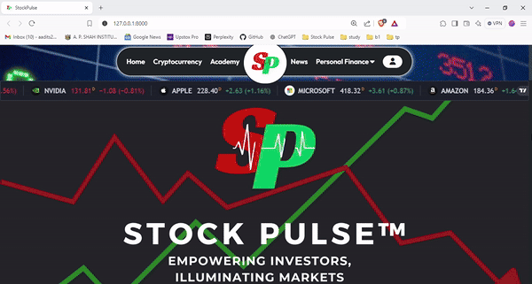
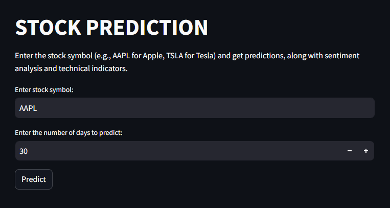
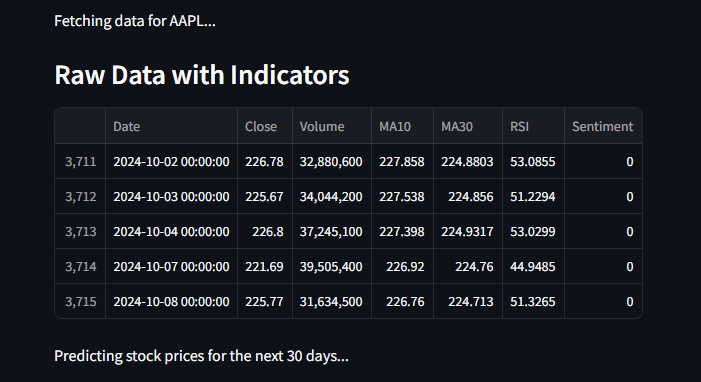
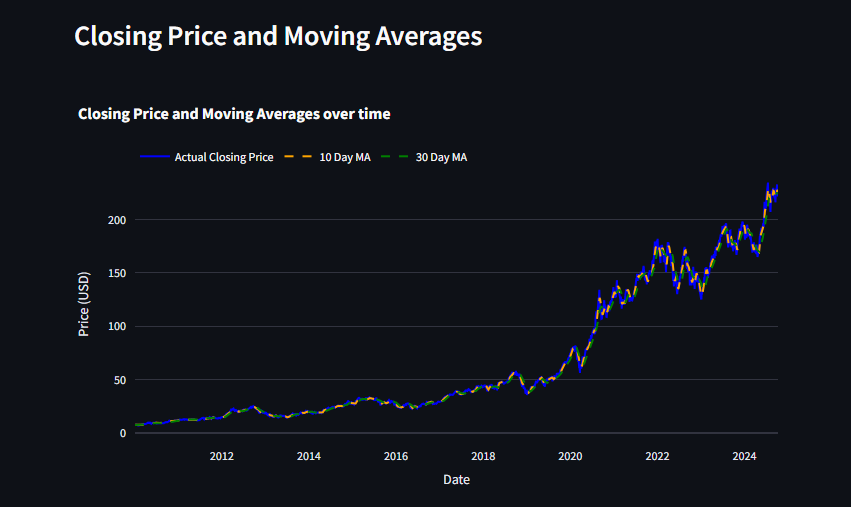
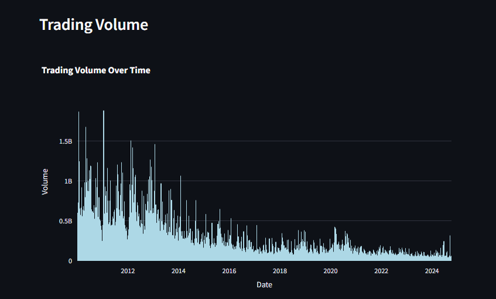
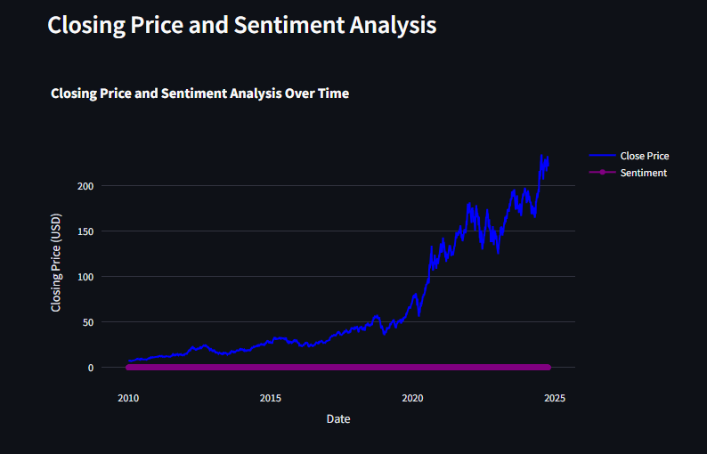
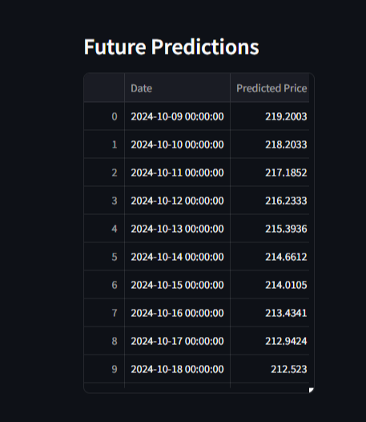
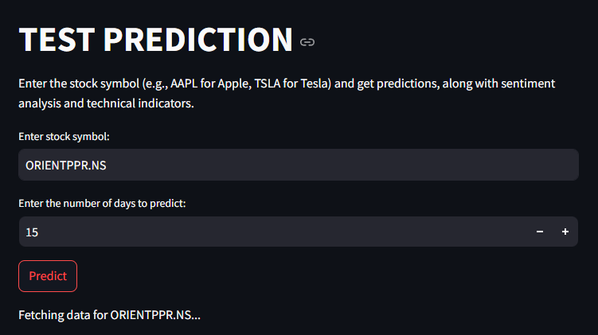
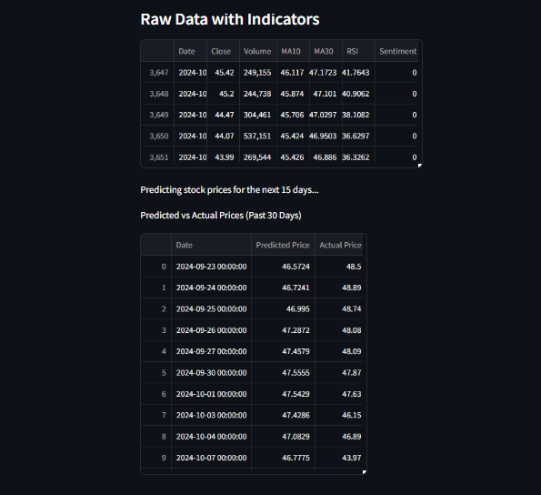
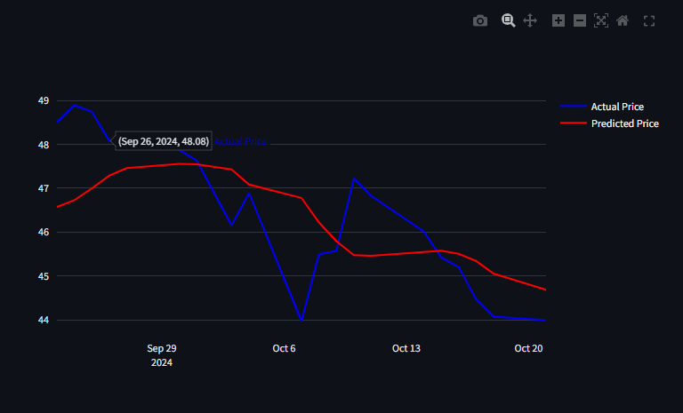

# Stock Prediction Website

## Project Description:
This project is a Streamlit-based web application that predicts stock prices using LSTM (Long Short-Term Memory) neural networks. The app also incorporates sentiment analysis of financial news and technical indicators like moving averages (MA) and RSI (Relative Strength Index) for enhanced stock price prediction.

## Features:

### Sentiment Analysis:
Sentiment is derived from the most recent 30 days of news articles related to the stock. The VADER sentiment model classifies the news as positive, neutral, or negative, and this sentiment is used as an input feature for the LSTM model.

### LSTM Model:
The Long Short-Term Memory (LSTM) model is trained on historical stock data (e.g., closing prices, volume) to predict future stock prices based on past trends and patterns.

### Technical Indicators:
Moving Averages (MA10, MA30) smooth out price data to highlight trends, while the RSI (Relative Strength Index) helps identify overbought or oversold conditions, aiding in price trend analysis.

### Trading Volume:
A bar chart displays the stock's trading volume over time, helping users easily spot peaks in activity and liquidity.

### Testing predictions:
To test the accuracy of the predictions made by the model, you can test the predictions by comparing it to the actual prices. The dataset is cut off at 30 days before the current date, allowing the user to test the model with actual stock market movement.

## Technologies Used:
- **Streamlit**: For building the web app interface.
- **TensorFlow/Keras**: For creating and training the LSTM model.
- **yfinance**: For fetching stock price data.
- **NewsAPI**: For retrieving financial news articles.
- **NLTK (VADER Sentiment)**: For sentiment analysis of news articles.
- **ta**: For calculating technical indicators like RSI.
  
## Screenshots:


 










## Setup Instructions:
To set up and run the project locally, follow these steps:

1. Clone the repository:
    ```bash
    git clone https://github.com/Aaidt/Stockpulse_v1.git
    ```
2. Navigate to the project directory:
    ```bash
    cd stockpulseapp
    ```
3. Create a virtual environment and activate it:
    ```bash
    python -m venv env
    # For Windows: .\env\Scripts\activate
    ```
4. Install the required packages:
    ```bash
    pip install -r requirements.txt
    ```
5. Add your NewsAPI Key:
    ```bash
   newsapi = NewsApiClient(api_key='YOUR_API_KEY_HERE')
   ```
7. Run the Streamlit app:
    ```bash
    streamlit run app.py
    ```
8. Run the StockPulse website:
    ```bash
    python manage.py runserver
    ```
    
## Usage:
1. Open the web app in your browser after running it locally.
2. Enter a stock symbol (e.g., AAPL for Apple, TSLA for Tesla).
3. Select the number of days to predict.
4. View the stock's price history, sentiment analysis, technical indicators, and future price predictions.


## Acknowledgements:
- [Streamlit](https://streamlit.io/): For building the web app interface.
- [TensorFlow/Kerashttps](https://www.tensorflow.org/): For creating and training the LSTM model.
- [yfinance](https://pypi.org/project/yfinance/): For fetching stock price data.
- [NewsAPI](https://newsapi.org/): For retrieving financial news articles.
- [NLTK (VADER Sentiment)](https://www.nltk.org/): For sentiment analysis of news articles
